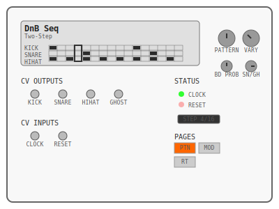
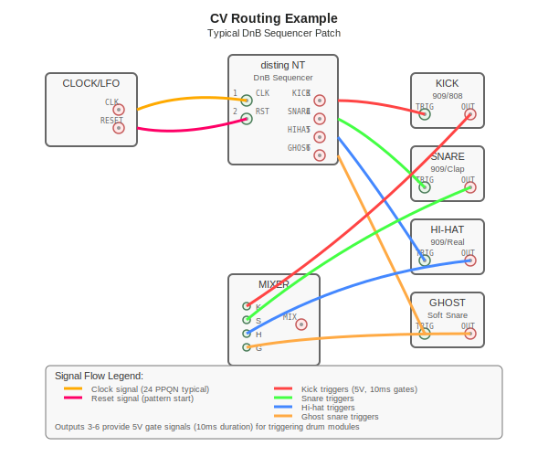
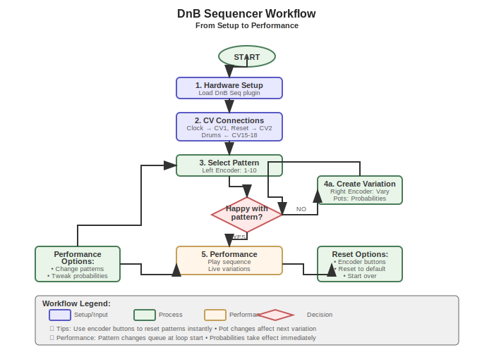

# DnB Seq - Drum & Bass Sequencer for Disting NT



## Overview

DnB Seq is a specialized drum sequencer plugin for the Expert Sleepers Disting NT platform, designed to generate classic Drum & Bass rhythm patterns. The plugin features 10 authentic DnB patterns with algorithmic variation capabilities, perfect for creating dynamic and evolving drum tracks in your Eurorack setup.

### Key Features

- **10 Classic DnB Patterns**: From foundational Two-Step to complex Neurofunk rhythms
- **4-Track Output**: Separate CV outputs for Kick, Snare, Hi-Hat, and Ghost Snare
- **Algorithmic Variations**: Generate pattern variations while preserving the backbeat
- **Real-Time Control**: Live pattern switching, probability controls, and instant reset
- **Sample-Accurate Timing**: Professional-grade sequencing with 24 PPQN clock support
- **Custom UI**: Visual pattern display with step indicators and track visualization

## Hardware Requirements

### disting NT Platform
- Expert Sleepers disting NT module
- ARM Cortex-M7 microcontroller with 8KB SRAM constraint
- Built-in display and encoder/pot interface


### Minimum Patch Requirements
- **Clock source**: Any clock/LFO providing 24 PPQN (6 pulses per 16th note)
- **Drum modules**: 1-4 drum voices (kick, snare, hi-hat, ghost snare)
- **Mixer** (optional): For combining drum outputs

## Installation

### Building from Source

```bash
# Clone the repository
git clone <repository-url>
cd dnb_seq

# Initialize and update git submodules
git submodule update --init --recursive

# Build the plugin
make all

# Validate memory constraints and symbols
make check

# Clean build artifacts
make clean
```

### Loading to disting NT

1. Copy the compiled `plugins/dnb_seq.o` file to `/programs/plug-ins` on the SD card
2. Load the plugin through the disting NT interface
3. The plugin will appear as "DnB Seq" in the algorithm list

## User Interface

### Main Display

The plugin features a custom graphical interface showing:

- **Pattern Name**: Currently selected pattern (e.g., "Two-Step", "Amen Break")
- **Step Grid**: Visual representation of all four drum tracks
- **Current Step**: Highlighted step indicator showing playback position
- **Track Labels**: Clear identification of Kick, Snare, Hi-Hat, and Ghost tracks

### Control Layout


| Control | Function | Description |
|---------|----------|-------------|
| **Left Encoder** | Pattern Selection | Cycle through 10 DnB patterns |
| **Left Encoder Button** | Reset Pattern | Return to original pattern state |
| **Right Encoder** | Generate Variation | Create algorithmic pattern variations |
| **Right Encoder Button** | Reset Pattern | Return to original pattern state |
| **Left Pot** | BD Probability | Control kick drum variation probability (0-100%) |
| **Right Pot** | SN/GH Probability | Control snare/ghost variation probability (split pot) |

### Parameter Pages

The plugin organizes controls into three logical pages:

1. **Pattern Page**: Pattern selection and basic controls
2. **Modify Page**: Variation generation and reset functions  
3. **Routing Page**: CV input/output assignments

## Pattern Library


### Available Patterns

| # | Pattern Name | Steps | Description |
|---|--------------|-------|-------------|
| 1 | **Two-Step** | 16 | Classic foundation - kick on 1 & 11, snare on 5 & 13 |
| 2 | **Delayed Two-Step** | 16 | Two-step variant with delayed second snare |
| 3 | **Steppa** | 16 | Minimal groove with ghost snare syncopation |
| 4 | **Stompa** | 16 | Heavy kick variant with ghost accents |
| 5 | **Dance Hall** | 16 | Reggae-influenced pattern with syncopated kick |
| 6 | **Dimension UK** | 32 | Extended pattern with complex snare work |
| 7 | **Halftime** | 16 | Slow groove - kick on 1, snare on 9 |
| 8 | **Triplet Two-Step** | 24 | Triplet-based groove with 3/4 subdivision |
| 9 | **Amen Break** | 16 | The legendary break with complex syncopation |
| 10 | **Neurofunk** | 16 | Modern complex pattern with tight hi-hats |

### Pattern Characteristics

- **Backbeat Preservation**: All variations maintain the essential snare hits on beats 2 and 4
- **Algorithmic Generation**: Random variations affect individual steps while preserving groove
- **Probability Control**: Separate control over kick, snare, and ghost snare variation likelihood

## CV Routing & Patching



### Input Connections

| Input | Purpose | Specification |
|-------|---------|---------------|
| **Input 1** | Clock Input | 24 PPQN clock signal |
| **Input 2** | Reset Input | Rising edge resets to step 1 (optional) |

### Output Connections

| Output | Purpose | Specification |
|--------|---------|---------------|
| **Output 3** | Kick Drum | 5V gate, 10ms duration |
| **Output 4** | Snare Drum | 5V gate, 10ms duration |
| **Output 5** | Hi-Hat | 5V gate, 10ms duration |
| **Output 6** | Ghost Snare | 5V gate, 10ms duration |

### Typical Patch

```
Clock/LFO → Input 1 (Clock Input)
Sequencer → Input 2 (Reset Input) [Optional]

Output 3 → Kick Drum Module
Output 4 → Snare Drum Module  
Output 5 → Hi-Hat Module
Output 6 → Ghost Snare Module

Drum Outputs → Mixer → Audio Output
```

## Workflow Guide



### Basic Setup

1. **Load Plugin**: Select "DnB Seq" from the disting NT algorithm list
2. **Connect Clock**: Patch your clock source to Input 1 (24 PPQN recommended)
3. **Connect Drums**: Route Output 3-6 to your drum modules
4. **Select Pattern**: Use left encoder to choose from 10 patterns
5. **Start Sequencing**: Begin clock to start pattern playback

### Performance Techniques

#### Live Pattern Switching
- **Pattern Queue**: Pattern changes queue at the start of the next loop
- **Seamless Transitions**: No glitches or timing issues when switching
- **Visual Feedback**: Display shows current and queued patterns

#### Variation Generation
- **Right Encoder**: Generate instant random variations
- **Seed Control**: Multiple encoder turns create different variation seeds
- **Probability Pots**: Control likelihood of variations per drum type

#### Reset Options
- **Encoder Buttons**: Instant reset to original pattern
- **Reset Input**: External reset via Input 2
- **Pattern Restart**: Reset always returns to step 1

### Advanced Usage

#### Probability Controls

The left and right pots provide sophisticated control over variation generation:

- **Left Pot**: Kick Drum Probability (0-100%)
  - 0%: No kick variations
  - 100%: Maximum kick randomization
  
- **Right Pot**: Snare/Ghost Probability (Split Control)
  - 0-50%: Snare probability (0-100%)
  - 50-100%: Ghost snare probability (0-100%)

#### Custom Variation Workflow

1. Select base pattern with left encoder
2. Set probability levels with pots
3. Generate variations with right encoder
4. Fine-tune probabilities for desired variation intensity
5. Reset to original with encoder buttons when needed

## Technical Specifications

### Timing Specifications
- **Clock Input**: 24 PPQN (6 pulses per 16th note step)
- **Gate Duration**: Fixed 10ms for all outputs
- **Sample Rate**: Supports standard Eurorack rates (48kHz typical)
- **Latency**: Sample-accurate timing with minimal latency

### Pattern Data
- **Step Resolution**: 16 steps (most patterns), 24 steps (Triplet), 32 steps (Dimension UK)
- **Track Count**: 4 simultaneous drum tracks
- **Pattern Storage**: 10 hardcoded patterns in flash memory
- **Variation Storage**: Real-time generation, no storage required

### Compatibility
- **Platform**: Expert Sleepers disting NT only
- **Firmware**: Compatible with current disting NT firmware
- **Standards**: Follows Eurorack CV/Gate standards (0-5V)

## Troubleshooting

### Common Issues

#### No Output
- **Check Clock**: Ensure clock signal is connected to Input 1
- **Verify Routing**: Confirm CV outputs 3-6 are properly connected
- **Pattern Selection**: Some patterns may have minimal elements (check step display)

#### Timing Issues
- **Clock Rate**: Verify 24 PPQN clock (6 pulses per 16th note)
- **Clock Level**: Ensure clock signal exceeds 1V threshold
- **Reset Conflicts**: Check if reset input (Input 2) is inadvertently triggered

#### Pattern Problems
- **Variation Stuck**: Use encoder buttons to reset to original pattern
- **Probabilities**: Check pot positions - extreme settings may reduce variation
- **Display Issues**: Pattern should be visible on screen - try pattern cycling

### Performance Tips

#### Optimal Clock Sources
- **Dedicated Clock**: Use a dedicated clock module for best timing
- **LFO Setup**: If using LFO, ensure consistent square/pulse wave output
- **Sync Issues**: For master/slave setups, ensure proper clock distribution

#### Drum Module Compatibility
- **Gate Length**: 10ms gates work with most drum modules
- **Trigger Sensitivity**: Adjust drum module trigger thresholds if needed
- **Multiple Triggers**: Some modules may require envelope followers for complex triggers

## Development Notes

### Code Structure
- **Single File**: Entire plugin contained in `dnb_seq.cpp`
- **Pattern Generation**: Hardcoded arrays with algorithmic variation
- **Memory Management**: Careful allocation within ARM Cortex-M7 constraints
- **Real-Time Safe**: All processing designed for real-time audio constraints

### Build System
- **Cross-Compilation**: Uses `arm-none-eabi-c++` for ARM target
- **Optimization**: Compiled with `-Os` for size optimization
- **Validation**: Automated checks for memory usage and undefined symbols

### Contributing
- **Pattern Requests**: Submit issues for additional pattern suggestions
- **Bug Reports**: Use GitHub issues for bug reports and feature requests
- **Code Style**: Follow existing code conventions and memory constraints

## License

MIT License - See LICENSE file for details

## Credits

- **Plugin Development**: Thorinside
- **Platform**: Expert Sleepers Disting NT
- **Patterns**: Based on classic Drum & Bass rhythms and breaks
- **API**: Expert Sleepers Disting NT SDK

---

*For more information about the Disting NT platform, visit [Expert Sleepers](https://www.expert-sleepers.co.uk/)*